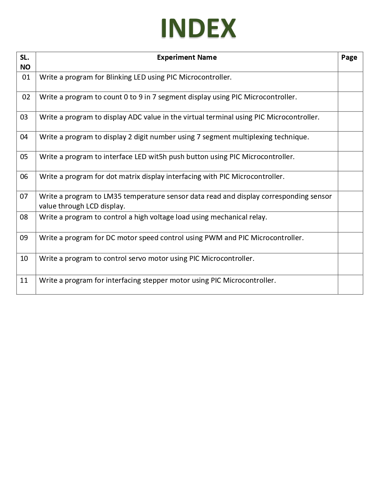

# COMPUTER-ARCHITECTURE-AND-MICROCONTROLLER

[![Youtube][youtube-shield]][youtube-url]
[![Facebook][facebook-shield]][facebook-url]
[![Instagram][instagram-shield]][instagram-url]
[![LinkedIn][linkedin-shield]][linkedin-url]

Thanks for visiting my GitHub account!

A **microcomputer** made on a single semiconductor chip is called single-chip microcomputer. Since, single chip microcomputers are generally used in control applications, they are also called microcontrollers.

**Microcontroller** contains all essential components of a microcomputer such as CPU, RAM, ROM/EPROM, I/O lines etc. Some single chip microcontrollers contain devices to perform specific functions such as DMA channels, A/D converter, serial port, pulse width modulation, etc. [see-more](https://www.javatpoint.com/microcontroller)

## Source Code (Download)

[Click Here](https://mega.nz/folder/tL00VSoQ#E4snCVQ3MAKOd-Nss7sWEA)

## Required Software (Download)

- Proteus , [download](https://getintopc.com/softwares/electrical-engineering/proteus-professional-2022-free-download/)
- mikroC, download-> https://www.mikroe.com/mikroc-pic

## Project Roadmap

|                              |
| :--------------------------: |
|  |

## Follow Me

    

<!-- MARKDOWN LINKS & IMAGES -->

[youtube-shield]: https://img.shields.io/badge/-Youtube-black.svg?style=flat-square&logo=youtube&color=555&logoColor=white
[youtube-url]: https://youtube.com/@learnwithfair
[facebook-shield]: https://img.shields.io/badge/-Facebook-black.svg?style=flat-square&logo=facebook&color=555&logoColor=white
[facebook-url]: https://facebook.com/learnwithfair
[instagram-shield]: https://img.shields.io/badge/-Instagram-black.svg?style=flat-square&logo=instagram&color=555&logoColor=white
[instagram-url]: https://instagram.com/learnwithfair
[linkedin-shield]: https://img.shields.io/badge/-LinkedIn-black.svg?style=flat-square&logo=linkedin&colorB=555
[linkedin-url]: https://linkedin.com/company/learnwithfair
